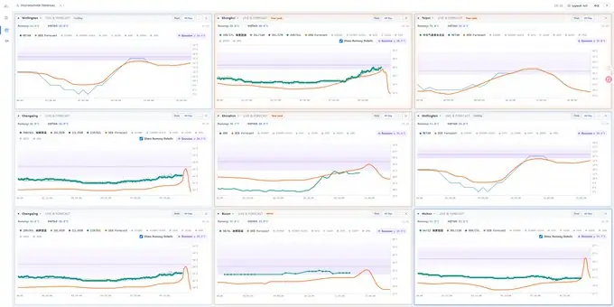
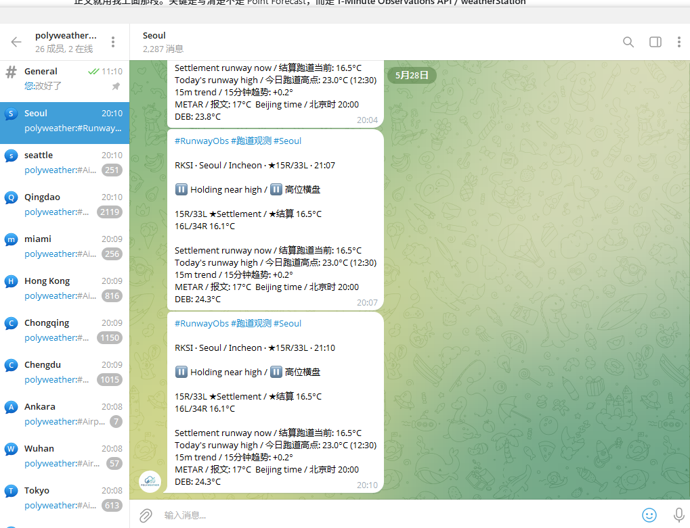
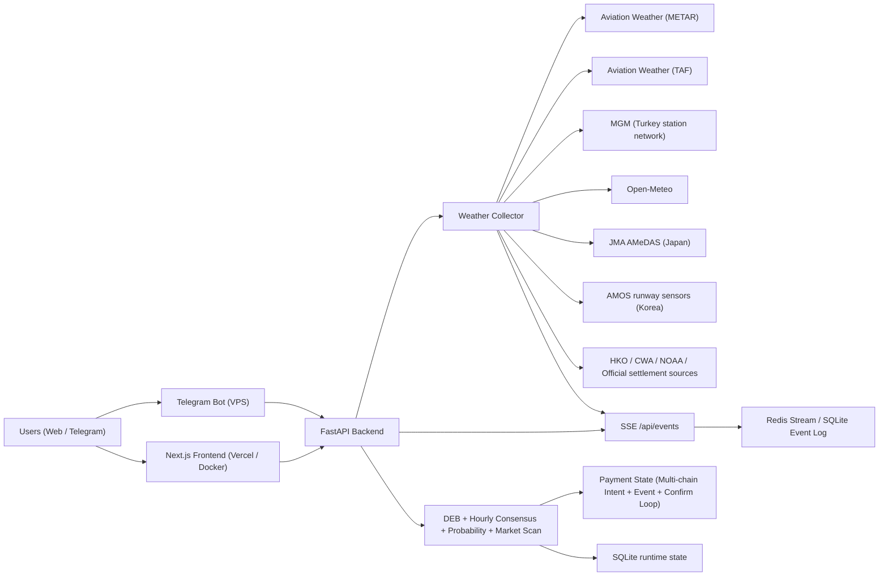

# PolyWeather Pro

Production weather-intelligence stack for **temperature settlement markets** (prediction markets like Polymarket). Aggregates real-time observations from dozens of global weather sources, applies a proprietary DEB (Dynamic Error Balancing) ensemble model, and presents actionable analysis through a web dashboard, Telegram bot, and browser extension.

Official dashboard: [polyweather.top](https://polyweather.top/)

## Product Screenshots

### Realtime Terminal



### Telegram Runway Alerts



## Star History

[](https://star-history.com/#yangyuan-zhen/PolyWeather&Date)

## Product Status

- **Onchain subscription** live: Pro Monthly (29.9 USDC) and Pro Quarterly (79.9 USDC) via Polygon smart contract checkout. Referral program active.
- **Realtime terminal** with SSE-driven live charts: observations stream via `/api/events` as `city_observation_patch.v1` patches with Redis Stream replay. Chart refresh is observation-driven — no loading overlay.
- **DEB hourly consensus** (`deb_hourly_consensus.v1`) is the preferred hourly forecast path for peak-window detection and chart overlays. DEB remains a forecast curve, never an observation source.
- **Settlement runway curves** visible by default for AMSC/AMOS cities; configured settlement runway highlighted with auxiliary runways as secondary context.
- **Calibrated probability** (legacy Gaussian) shown as the primary probability panel; model-market difference indicates `model probability - market-implied probability`.
- **Market bucket matching** uses the full `all_buckets` surface with strict exact/range/or-higher/or-lower direction checks.
- **Intraday analysis** provides professional meteorology read: headline, confidence, base/upside/downside paths, evidence chain, failure modes, confirmation rules.
- **Telegram bot** with bilingual airport/runway pushes, settlement-endpoint runway temperatures.
- **Ops dashboard** (`/ops`) for membership management, user feedback triage, point grants, payment incident triage.
- **Onchain payment system**: Polygon contract checkout (USDC/USDC.e) + Ethereum mainnet USDC direct-transfer auto-reconciliation via event listener + periodic confirm loop.
- **Browser extension** uses DEB for multi-day forecast as a lightweight lead-in to the main site.
- **TAF parsing** for non-Hong Kong airport cities with timing overlays and disruption interpretation.
- **Official nearby-network layers**: MGM (Turkey), CMA/NMC (Mainland China), JMA AMeDAS (Japan), AMOS (Korea runway-level), HKO (Hong Kong), CWA (Taiwan).
- **51 monitored cities** across EMEA, APAC, Americas, and South Asia.

## License & Commercial Boundary

This repository is licensed under **GNU AGPL-3.0 only** from `2026-03-30` onward.

- Public in repo: weather aggregation, core analysis, dashboard, bot baseline, and standard payment flow.
- Not included in this repository: private production data, internal operating thresholds, commercial risk rules, pricing strategy details, and growth tooling.
- Trademark, brand, domain, production databases, and hosted-service operations are **not** granted by the code license.

See the AGPL-3.0 license text in the repository root for full terms.

## Core Capabilities

- Aggregates observations and forecasts for 51 monitored cities globally.
- **DEB (Dynamic Error Balancing)** — proprietary algorithm that blends multi-model high-temperature forecasts with dynamically weighted error balancing.
- **DEB Hourly Consensus** — preferred hourly forecast path for peak-window detection and chart overlays.
- **Settlement-source oriented** — each city configured with a specific settlement weather station matching the prediction market's official source.
- **Calibrated probability** (legacy Gaussian) with `mu` + full bucket distribution by temperature range.
- **Real-time SSE patches** — observations streamed via Server-Sent Events with Redis Stream replay.
- **Terminal chart/detail workflow** combining settlement observations, DEB hourly consensus, model context, probability distributions, and market-bucket mapping.
- **Multi-layer data sources**: METAR, TAF, Open-Meteo, AMOS (Korea runway), AMSC AWOS (China runway), HKO, JMA AMeDAS, CWA, MGM, NOAA, MADIS, FMI, KNMI, CoWIN, IMS, NCM, AEROWEB, Singapore MSS, Wunderground.
- **Onchain payment system** with Polygon smart contract checkout, Ethereum USDC direct-transfer, auto-reconciliation, and incident visibility in ops.
- **Telegram bot** with bilingual push notifications for airport/runway temperature alerts.
- **Polymarket trading engine** — automated signal ingestion, order management, position tracking, risk engine.
- **In-app feedback loop** with chart context, status tracking, ops triage, and point rewards.
- **Single analysis core** reused across web dashboard, Telegram bot, and browser extension.

## Reference Architecture



## Monitored Cities (51)

- **EMEA**: Ankara, Istanbul, Moscow, London, Paris, Munich, Milan, Warsaw, Madrid, Tel Aviv, Amsterdam, Helsinki, Lagos, Cape Town, Jeddah
- **APAC**: Seoul, Busan, Hong Kong, Lau Fau Shan, Taipei, Shanghai, Beijing, Qingdao, Wuhan, Chengdu, Chongqing, Shenzhen, Guangzhou, Singapore, Tokyo, Kuala Lumpur, Jakarta, Manila, Wellington
- **Americas**: Toronto, New York, Los Angeles, San Francisco, Aurora, Austin, Houston, Chicago, Dallas, Miami, Atlanta, Seattle, Mexico City, Buenos Aires, São Paulo, Panama City
- **South Asia**: Lucknow, Karachi

## Quick Start

### Backend + Bot (Docker)

```bash
docker compose up -d --build
```

### Frontend (local)

```bash
cd frontend
npm ci
npm run dev
```

## Runtime Data (Recommended on VPS)

Use external runtime storage to avoid SQLite/git conflicts:

```env
POLYWEATHER_RUNTIME_DATA_DIR=/var/lib/polyweather
POLYWEATHER_DB_PATH=/var/lib/polyweather/polyweather.db
POLYWEATHER_STATE_STORAGE_MODE=sqlite
POLYWEATHER_EVENT_STORE=redis
POLYWEATHER_REDIS_URL=redis://polyweather_redis:6379/0
POLYWEATHER_REDIS_STREAM_MAXLEN=50000
POLYWEATHER_REDIS_REQUIRED=true
```

For local development or a strict single-process fallback, keep `POLYWEATHER_EVENT_STORE=sqlite`.

## Ops Verification

### Health / system status / metrics

```bash
curl http://127.0.0.1:8000/healthz
curl http://127.0.0.1:8000/api/system/status
curl http://127.0.0.1:8000/metrics
```

### Frontend cache headers

```bash
./scripts/validate_frontend_cache.sh "https://polyweather.top"
```

### Payment auto-reconciliation logs

```bash
docker compose logs -f polyweather | egrep "payment event loop started|payment confirm loop started|payment auto-confirmed"
```

### Payment runtime

```bash
curl http://127.0.0.1:8000/api/payments/runtime
```

### Payment chains

Production payment routes are configured by the backend. Polygon remains the default checkout-contract chain, while Ethereum mainnet USDC can be enabled as a direct-transfer route so users who pay on their wallet default network are still confirmed by `intent.chain_id`.

## Telegram Commands

| Command | Purpose |
| :-- | :-- |
| `/top` | User leaderboard |
| `/id` | Show current chat ID |
| `/diag` | Startup diagnostics |
| `/help` | Help and usage |

## Documentation

- [Release process](RELEASE.md)
- [Changelog](CHANGELOG.md)

## Version

- Version: `v1.8.1`
- Last Updated: `2026-07-04`
