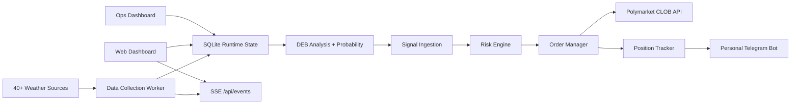

# PolyWeather

Automated **weather-driven trading engine** for Polymarket temperature prediction markets. Collects real-time observations from 40+ global weather sources, runs a DEB (Dynamic Ensemble Blending) model to forecast daily high temperatures, generates trade signals, and executes orders on the Polymarket CLOB — all via a single integrated pipeline.

Web dashboard: [polyweather.top](https://polyweather.top/) | API: `https://api.polyweather.top`

---

## What It Does

PolyWeather transforms raw weather data into automated trades on Polymarket temperature outcome markets:

1. **Collect** — Pulls observations from 40+ sources (METAR, AMOS, AMSC AWOS, HKO, JMA, Open-Meteo, NOAA, and more) at source-native frequencies.
2. **Analyze** — Runs DEB (Dynamic Ensemble Blending) to produce a weighted multi-model high-temperature forecast per city, with bias correction, intraday adjustment, and calibrated probability distributions.
3. **Signal** — Converts analysis into trade signals based on temperature anomaly thresholds, confidence levels, and probability-implied edges.
4. **Trade** — Executes on Polymarket via CLOB client (EIP-712 auth, order management, neg-risk adapter) with a configurable risk engine (max position, drawdown, cooldown, slippage).
5. **Notify** — Pushes trade signals and P&L to a personal Telegram chat.

---

## Architecture



### Components

| Layer | Location | Responsibility |
|-------|----------|----------------|
| **Data Collection** | `src/data_collection/` | 40+ source adapters with rate limiting, singleflight, and freshness tracking |
| **Trading Engine** | `src/trading/` | Signal ingestion, Polymarket CLOB client, order management, risk engine, position tracking, trade storage |
| **DEB Analysis** | `src/analysis/` | Multi-model ensemble blending, bias correction, hourly path correction, probability distribution |
| **Web Service** | `web/` | FastAPI backend: city data, SSE streams, trading API, ops dashboards, system health |
| **Frontend** | `frontend/` | Next.js 15 dashboard: live terminal, accuracy tracking, ops panel |
| **Bot** | `src/bot/` | Minimal personal Telegram bot for trade signal push (no community features) |
| **Infrastructure** | `src/async_infra/` | Event loop manager, async HTTP client, rate limiter, retry logic, Redis client |

---

## Data Sources (40+)

PolyWeather aggregates observations from a diverse global network of station-level temperature sources, prioritized by market settlement relevance:

| Source | Coverage | Type |
|--------|----------|------|
| **METAR** | Global (aviationweather.gov) | Airport observations |
| **AMOS** | South Korea | Runway-level sensors |
| **AMSC AWOS** | Mainland China | Runway-level sensors |
| **Open-Meteo** | Global | Multi-model forecasts |
| **NOAA WRH** | United States | Timeseries observations |
| **HKO** | Hong Kong | Official station |
| **JMA AMeDAS** | Japan | Automated meteorological data |
| **CWA** | Taiwan | Open data observations |
| **MGM** | Turkey | Station network |
| **KMA** | South Korea | Station network |
| **FMI** | Finland | WFS observations |
| **KNMI** | Netherlands | Open data observations |
| **IMS** | Israel | Meteorological service |
| **NCM** | Saudi Arabia | Station network |
| **MADIS** | United States | High-frequency observations |
| **Singapore MSS** | Singapore | Meteorological service |
| **MSS (multi-model)** | Global | ECMWF, GFS, ICON, GEM, HRDPS |

---

## Quick Start

### Full stack (Docker)

```bash
docker compose up -d --build
```

This starts four containers:
- `polyweather_web` — FastAPI backend (port 8000)
- `polyweather_frontend` — Next.js dashboard (port 3001)
- `polyweather_collector` — Background observation collection worker
- `polyweather_redis` — Redis for SSE event streaming

### Frontend development

```bash
cd frontend
npm ci
npm run dev
```

### Environment

Copy `.env.example` to `.env` and configure at minimum:

```env
# Weather data collection
POLYWEATHER_OBSERVATION_COLLECTOR_ENABLED=true

# Trading engine (disabled by default)
POLYWEATHER_TRADING_ENABLED=false
POLY_MARKET_MAP={}

# Telegram bot (personal signal push)
TELEGRAM_BOT_TOKEN=your_token
TELEGRAM_BOT_CHAT_ID=your_chat_id

# Polymarket wallet
POLY_TRADING_PRIVATE_KEY=...
```

See [Full configuration](#configuration) below for all options.

---

## Configuration

### Trading Engine

| Variable | Default | Description |
|----------|---------|-------------|
| `POLYWEATHER_TRADING_ENABLED` | `false` | Master switch for the trading engine |
| `POLY_MARKET_MAP` | `{}` | ICAO → (condition_id, token_id) JSON mapping |
| `POLY_TRADING_PRIVATE_KEY` | — | Trading wallet private key (Polygon) |
| `POLY_MAX_POSITION_SIZE_USDC` | `500` | Per-market position cap |
| `POLY_MAX_TOTAL_EXPOSURE_USDC` | `5000` | Total portfolio exposure cap |
| `POLY_MIN_CONFIDENCE` | `0.6` | Minimum signal confidence threshold |
| `POLY_TRADING_POLL_SECONDS` | `60` | Signal polling interval |
| `POLY_TRADING_RECONCILE_SECONDS` | `300` | CLOB reconciliation interval |

### Observation Collection

| Variable | Default | Description |
|----------|---------|-------------|
| `POLYWEATHER_OBSERVATION_COLLECTOR_TICK_SEC` | `30` | Main collector tick rate (s) |
| `POLYWEATHER_OBSERVATION_COLLECTOR_INITIAL_DELAY_SEC` | `5` | Startup delay (s) |
| `POLYWEATHER_OBSERVATION_COLLECTOR_AMOS_SEC` | `60` | AMOS poll interval (s) |
| `POLYWEATHER_OBSERVATION_COLLECTOR_HKO_SEC` | `600` | HKO poll interval (s) |
| `POLYWEATHER_OBSERVATION_COLLECTOR_MADIS_SEC` | `300` | MADIS poll interval (s) |

### Backend

| Variable | Default | Description |
|----------|---------|-------------|
| `POLYWEATHER_REDIS_URL` | `redis://localhost:6379/0` | Redis connection string |
| `POLYWEATHER_EVENT_STORE` | `sqlite` | Event store backend (`sqlite` or `redis`) |
| `POLYWEATHER_REDIS_STREAM_MAXLEN` | `50000` | Redis stream max length |
| `POLYWEATHER_REDIS_REQUIRED` | `true` | Fail if Redis unavailable |
| `POLYWEATHER_STATE_STORAGE_MODE` | `sqlite` | Runtime state backend |
| `POLYWEATHER_DB_PATH` | `data/polyweather.db` | SQLite database path |

---

## API Endpoints

### System

```bash
curl https://api.polyweather.top/healthz          # Health check
curl https://api.polyweather.top/api/system/status # System status
curl https://api.polyweather.top/metrics           # Prometheus metrics
```

### Trading

```bash
curl https://api.polyweather.top/api/trading/status   # Engine health, P&L, risk
curl https://api.polyweather.top/api/trading/orders   # Order history
curl https://api.polyweather.top/api/trading/signals  # Signal history
curl https://api.polyweather.top/api/trading/fills    # Fill records
```

### Weather Data

```bash
curl https://api.polyweather.top/api/city/RKSS       # City detail + analysis
curl https://api.polyweather.top/api/scan?region=east_asia  # Terminal scan
```

---

## Project Structure

```
PolyWeather/
├── src/                    # Python backend
│   ├── analysis/           # DEB ensemble, probability, evaluation
│   ├── async_infra/        # Event loop, HTTP client, rate limiter, Redis
│   ├── bot/                # Personal Telegram push bot
│   ├── data_collection/    # Weather source adapters (40+)
│   │   └── sources/        # Individual source implementations
│   ├── database/           # SQLite runtime state persistence
│   ├── models/             # Pydantic model definitions
│   ├── trading/            # Trading engine
│   │   ├── engine/         # Signal ingestion, risk, order mgmt, positions
│   │   ├── polymarket/     # CLOB client, Data API, wallet, neg-risk
│   │   └── storage/        # Trade history persistence
│   └── utils/              # Config, logging, metrics, secrets
├── web/                    # FastAPI web service
│   ├── routers/            # API route modules
│   └── services/           # Business logic
├── frontend/               # Next.js 15 dashboard
├── tests/                  # Pytest test suite
├── contracts/              # Solidity smart contracts (legacy)
├── deploy/                 # Nginx, Docker, CI configuration
└── scripts/                # Backfill, backtest, migration utilities
```

---

## Development

```bash
# Python
python -m ruff check .          # Lint
python -m pytest                # Run tests
uvicorn web.app:app --reload --host 0.0.0.0 --port 8000  # Dev server

# Frontend
cd frontend && npm run dev      # Dev server :3000
cd frontend && npm run typecheck  # TypeScript checks
cd frontend && npm run test:business  # Business state tests
```

---

## Version

- **Version:** `v1.8.1`
- **License:** GNU AGPL-3.0 (from 2026-03-30 onward)
- **Last Updated:** `2026-07-04`

See [RELEASE.md](RELEASE.md) for the release process and [CHANGELOG.md](CHANGELOG.md) for history.
